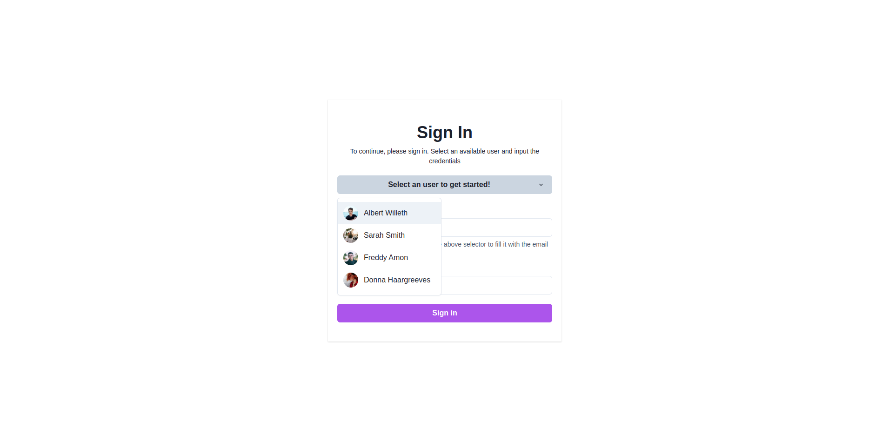
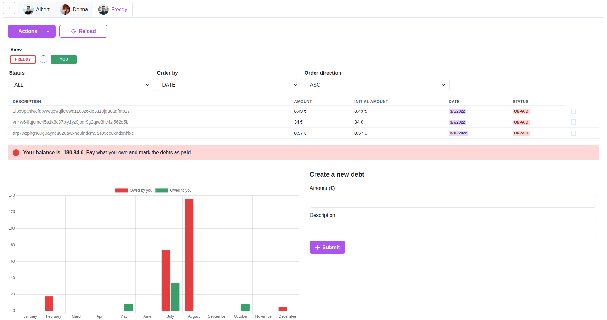

# Fundebt

Fundebt is a debt management dashboard with which you can manage your debts and see what you owe and what is owed to you by the users with whom you are generally indebted.

## Purpose

I recently moved in with my partner and was surprised not to find an application that met this need. That's why I decided to create this application which, to be true, is not perfect but for the moment it works for us :D.

## Features

### Create your environment

I have tried to make the application configurable to certain limits so that others can deploy it on their own VPS or local network.

Through the environment variables you can control the number of users that will be created, their information, security and aesthetic details.

### Manage your debts

A simple dashboard, which intelligently manages how debts cancel each other and is able to mark them as paid automatically.

Also, other features that can make the application attractive are the following:

- Debts are updated, cancelled or marked as paid automatically
- Easy to build, manage and run thanks to `docker-compose`
- Aesthetic design
- Includes a `PhpMyAdmin` instance
- Displays the total balance between you and the selected user
- Available as a PWA
- Useful charts

### Deploy

To deploy on the local network or on a VPS just download this repo and populate the following environment variables. The variables must be visible for the `docker-compose.yml` file. You can find different versions of this app in the [releases](https://github.com/carlos-molero/fundebt/releases) section.

### Environment variables reference

| Variable                           | Description                                                                                                                                                                                          |
| ---------------------------------- | ---------------------------------------------------------------------------------------------------------------------------------------------------------------------------------------------------- |
| `SSH_USERNAME`                     | The ssh username of the VPS (not required if deploying locally)                                                                                                                                      |
| `SSH_PASSWORD`                     | The ssh password of the VPS (not required if deploying locally)                                                                                                                                      |
| `INSTANCE_IP`                      | The IP of your VPS instance (not required if deploying locally)                                                                                                                                      |
| `SPRING_DATASOURCE_USERNAME`       | Username of the MySQL user (root)                                                                                                                                                                    |
| `SPRING_DATASOURCE_PASSWORD`       | Password of the MySQL user                                                                                                                                                                           |
| `USER{N}_PASSWORD` `USER{N}_EMAIL` | Users are created at each start of the application if there are none existing in the database. Add as many groups of environment variables (EMAIL, PASSWORD) and avatars as users you want to create |
| `ACCESS_TOKEN_SECRET`              | > 256b key (only numbers and letters)                                                                                                                                                                |
| `ACCESS_TOKEN_EXPIRATION_DAYS`     | Expiration time in days                                                                                                                                                                              |
| `ALLOWED_ORIGINS`                  | If you are using a domain add it here                                                                                                                                                                |
| `REDUX_PERSIST_KEY`                | The key to name the persisted data in the `localStorage`                                                                                                                                             |
| `CURRENCY`                         | Your currency symbol                                                                                                                                                                                 |

### Ports

- The `Spring Boot` server will be available on port `8080`.
- `PhpMyAdmin` will be available on port `8081`. Use `db` as server and `SPRING_DATASOURCE_USERNAME`/`SPRING_DATASOURCE_PASSWORD` as username and password.
- The front end will be served from the root of the `Spring Boot` server so, navigating to `http://localhost:8080` will bring you there :).

## Support this stuff

If you have found this project useful, please consider supporting me and encourage me to continue writing useful software!

